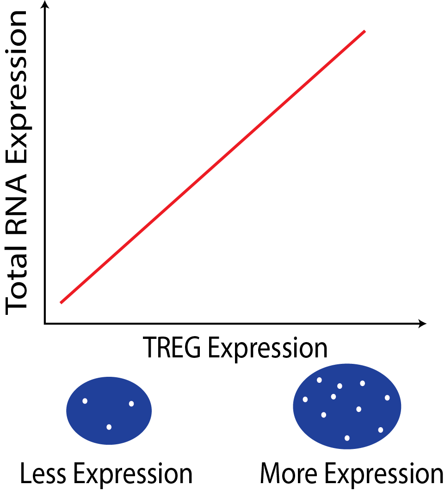
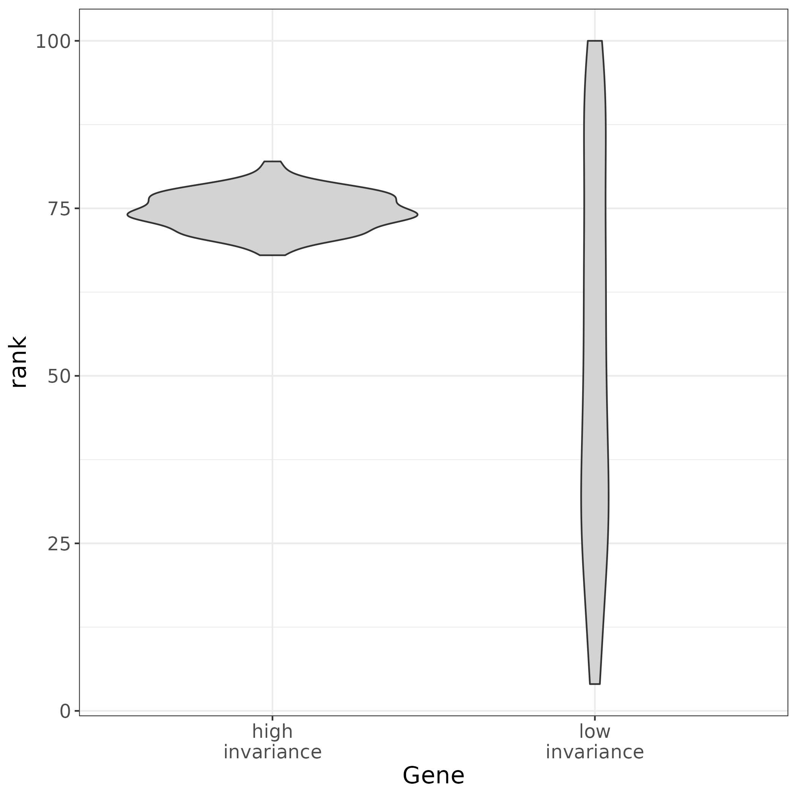

<!-- README.md is generated from README.Rmd. Please edit that file -->

# TREG

<!-- badges: start -->

[](https://zenodo.org/badge/latestdoi/391101988)
[](https://lifecycle.r-lib.org/articles/stages.html#stable)
[](https://bioconductor.org/checkResults/release/bioc-LATEST/TREG)
[](https://github.com/LieberInstitute/TREG/actions)
[](https://codecov.io/gh/LieberInstitute/TREG?branch=main)
<!-- badges: end -->

The goal of `TREG` is to help find candidate **Total RNA Expression
Genes (TREGs)** in single nucleus (or single cell) RNA-seq data.

***Note**: TREG is pronounced as a single word and fully capitalized,
unlike [Regulatory T
cells](https://en.wikipedia.org/wiki/Regulatory_T_cell), which are known
as “Tregs” (pronounced “T-regs”). The work described here is unrelated
to regulatory T cells.*

### Why are TREGs useful?

The expression of a TREG is proportional to the the overall RNA
expression in a cell. This relationship can be used to estimate total
RNA content in cells in assays where only a few genes can be measured,
such as single-molecule fluorescent in situ hybridization (smFISH).

In a smFISH experiment the number of TREG puncta can be used to infer
the total RNA expression of the cell.

The motivation of this work is to collect data via smFISH in to help
build better deconvolution algorithms. But may be many other application
for TREGs in experimental design!

<p align="center">

<figure>

<figcaption aria-hidden="true">The Expression of a TREG can inform total
RNA content of a cell</figcaption>
</figure>

</p>

### What makes a gene a good TREG?

1.  The gene must have **non-zero expression in most cells** across
    different tissue and cell types.

2.  A TREG should also be expressed at a constant level in respect to
    other genes across different cell types or have **high rank
    invariance**.

3.  Be **measurable as a continuous metric** in the experimental assay,
    for example have a dynamic range of puncta when observed in
    RNAscope. This will need to be considered for the candidate TREGs,
    and may need to be validated experimentally.

<p align="center">

<figure>

<figcaption aria-hidden="true">Distribution of ranks of a gene of High
and Low Invariance</figcaption>
</figure>

</p>

### How to find candidate TREGs with `TREG`

<p align="center">

<figure>

<figcaption aria-hidden="true">Overview of the Rank Invariance
Process</figcaption>
</figure>

</p>

1.  **Filter for low Proportion Zero genes snRNA-seq dataset:** This is
    facilitated with the functions `get_prop_zero()` and
    `filter_prop_zero()`. snRNA-seq data is notoriously sparse, these
    functions enrich for genes with more universal expression.

2.  **Evaluate genes for Rank Invariance** The nuclei are grouped only
    by cell type. Within each cell type, the mean expression for each
    gene is ranked, the result is a vector (length is the number of
    genes), using the function `rank_group()`. Then the expression of
    each gene is ranked for each nucleus,the result is a matrix (the
    number of nuclei x number of genes), using the function
    `rank_cells()`.Then the absolute difference between the rank of each
    nucleus and the mean expression is found, from here the mean of the
    differences for each gene is calculated, then ranked. These steps
    are repeated for each group, the result is a matrix of ranks,
    (number of cell types x number of genes). From here the sum of the
    ranks for each gene are reversed ranked, so there is one final value
    for each gene, the “Rank Invariance” The genes with the highest
    rank-invariance are considered good candidates as TREGs. This is
    calculated with `rank_invariance_express()`. **This full process is
    implemented by: `rank_invariance_express()`.**

## Installation instructions

Get the latest stable `R` release from
[CRAN](http://cran.r-project.org/). Then install `TREG` using from
[Bioconductor](http://bioconductor.org/) the following code:

``` r
if (!requireNamespace("BiocManager", quietly = TRUE)) {
    install.packages("BiocManager")
}

BiocManager::install("TREG")
```

And the development version from
[GitHub](https://github.com/LieberInstitute/TREG) with:

``` r
BiocManager::install("LieberInstitute/TREG")
```

## Example

``` r
## Load packages
library("TREG")
```

### Proportion Zero Filtering

A TREG gene should be expressed in almost every cell. The set of genes
should be filtered by maximum Proportion Zero within a groups of cells.

``` r
## Calculate Proportion Zero in groups defined by a column in colData
(prop_zero <- get_prop_zero(sce = sce_zero_test, group_col = "cellType"))
#>           A    B
#> g100   1.00 1.00
#> g50    0.48 0.52
#> g0     0.00 0.00
#> gOffOn 0.50 0.50
#> gVar   0.58 0.36

## Get list of genes that pass the max Proportion Zero filter
(filtered_genes <- filter_prop_zero(prop_zero, cutoff = 0.9))
#> [1] "g50"    "g0"     "gOffOn" "gVar"

## Filter sce object to this list of genes
sce_filter <- sce_zero_test[filtered_genes, ]
```

### Evaluate RI for Filtered SCE Data

The genes with the highest Rank Invariance are considered good
candidates as TREGs. In this example the gene *g0* would be the
strongest candidate TREG.

``` r
## Get the Rank Invariance value for each gene
## The highest values are the best TREG candidates
ri <- rank_invariance_express(sce_filter)
sort(ri, decreasing = TRUE)
#>     g0 gOffOn   gVar    g50 
#>      4      3      2      1
```

## Citation

Below is the citation output from using `citation('TREG')` in R. Please
run this yourself to check for any updates on how to cite **TREG**.

``` r
print(citation("TREG"), bibtex = TRUE)
#> 
#> To cite package 'TREG' in publications use:
#> 
#>   Huuki-Myers LA, Collado-Torres L (2023). _TREG: a R/Bioconductor
#>   package to identify Total RNA Expression Genes_.
#>   doi:10.18129/B9.bioc.TREG <https://doi.org/10.18129/B9.bioc.TREG>,
#>   https://github.com/LieberInstitute/TREG/TREG - R package version
#>   1.1.1, <http://www.bioconductor.org/packages/TREG>.
#> 
#> A BibTeX entry for LaTeX users is
#> 
#>   @Manual{,
#>     title = {TREG: a R/Bioconductor package to identify Total RNA Expression Genes},
#>     author = {Louise A. Huuki-Myers and Leonardo Collado-Torres},
#>     year = {2023},
#>     url = {http://www.bioconductor.org/packages/TREG},
#>     note = {https://github.com/LieberInstitute/TREG/TREG - R package version 1.1.1},
#>     doi = {10.18129/B9.bioc.TREG},
#>   }
#> 
#>   Huuki-Myers LA, Montgomery KD, Kwon SH, Page SC, Hicks SC, Maynard
#>   KR, Collado-Torres L (2022). "Data Driven Identification of Total RNA
#>   Expression Genes "TREGs" for estimation of RNA abundance in
#>   heterogeneous cell types." _bioRxiv_. doi:10.1101/2022.04.28.489923
#>   <https://doi.org/10.1101/2022.04.28.489923>,
#>   <https://doi.org/10.1101/2022.04.28.489923>.
#> 
#> A BibTeX entry for LaTeX users is
#> 
#>   @Article{,
#>     title = {Data Driven Identification of Total RNA Expression Genes "TREGs" for estimation of RNA abundance in heterogeneous cell types},
#>     author = {Louise A. Huuki-Myers and Kelsey D. Montgomery and Sang Ho. Kwon and Stephanie C. Page and Stephanie C. Hicks and Kristen R. Maynard and Leonardo Collado-Torres},
#>     year = {2022},
#>     journal = {bioRxiv},
#>     doi = {10.1101/2022.04.28.489923},
#>     url = {https://doi.org/10.1101/2022.04.28.489923},
#>   }
```

Please note that the `TREG` was only made possible thanks to many other
R and bioinformatics software authors, which are cited either in the
vignettes and/or the paper(s) describing this package.

## Code of Conduct

Please note that the `TREG` project is released with a [Contributor Code
of Conduct](http://bioconductor.org/about/code-of-conduct/). By
contributing to this project, you agree to abide by its terms.

## Development tools

- Continuous code testing is possible thanks to [GitHub
  actions](https://www.tidyverse.org/blog/2020/04/usethis-1-6-0/)
  through *[usethis](https://CRAN.R-project.org/package=usethis)*,
  *[remotes](https://CRAN.R-project.org/package=remotes)*, and
  *[rcmdcheck](https://CRAN.R-project.org/package=rcmdcheck)* customized
  to use [Bioconductor’s docker
  containers](https://www.bioconductor.org/help/docker/) and
  *[BiocCheck](https://bioconductor.org/packages/3.15/BiocCheck)*.
- Code coverage assessment is possible thanks to
  [codecov](https://codecov.io/gh) and
  *[covr](https://CRAN.R-project.org/package=covr)*.
- The [documentation website](http://LieberInstitute.github.io/TREG) is
  automatically updated thanks to
  *[pkgdown](https://CRAN.R-project.org/package=pkgdown)*.
- The code is styled automatically thanks to
  *[styler](https://CRAN.R-project.org/package=styler)*.
- The documentation is formatted thanks to
  *[devtools](https://CRAN.R-project.org/package=devtools)* and
  *[roxygen2](https://CRAN.R-project.org/package=roxygen2)*.

For more details, check the `dev` directory.

This package was developed using
*[biocthis](https://bioconductor.org/packages/3.15/biocthis)*.

:)
