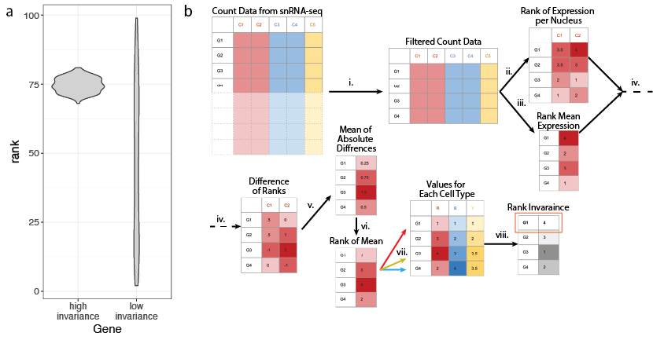

<!-- README.md is generated from README.Rmd. Please edit that file -->

# TREG

<!-- badges: start -->

[](https://lifecycle.r-lib.org/articles/stages.html#experimental)
[](https://bioconductor.org/checkResults/release/bioc-LATEST/TREG)
<!-- badges: end -->

The goal of `TREG` is to help find finding Total RNA Expression Genes
(TREGs) in single nucleus RNA-seq data.



## Installation instructions

Get the latest stable `R` release from
[CRAN](http://cran.r-project.org/). Then install `TREG` using from
[Bioconductor](http://bioconductor.org/) the following code:

``` r
if (!requireNamespace("BiocManager", quietly = TRUE)) {
    install.packages("BiocManager")
}

BiocManager::install("TREG")
```

And the development version from
[GitHub](https://github.com/LieberInstitute/TREG) with:

``` r
BiocManager::install("LieberInstitute/TREG")
```

## Example

### Proption Zero Filtering

A Good TREG candidate gene will be expressed in almost every cell. So
the list of genes should be filtered by proportion of zeros across
groups of cells.

``` r
library("TREG")
#> Loading required package: SingleCellExperiment
#> Loading required package: SummarizedExperiment
#> Loading required package: MatrixGenerics
#> Loading required package: matrixStats
#> 
#> Attaching package: 'MatrixGenerics'
#> The following objects are masked from 'package:matrixStats':
#> 
#>     colAlls, colAnyNAs, colAnys, colAvgsPerRowSet, colCollapse,
#>     colCounts, colCummaxs, colCummins, colCumprods, colCumsums,
#>     colDiffs, colIQRDiffs, colIQRs, colLogSumExps, colMadDiffs,
#>     colMads, colMaxs, colMeans2, colMedians, colMins, colOrderStats,
#>     colProds, colQuantiles, colRanges, colRanks, colSdDiffs, colSds,
#>     colSums2, colTabulates, colVarDiffs, colVars, colWeightedMads,
#>     colWeightedMeans, colWeightedMedians, colWeightedSds,
#>     colWeightedVars, rowAlls, rowAnyNAs, rowAnys, rowAvgsPerColSet,
#>     rowCollapse, rowCounts, rowCummaxs, rowCummins, rowCumprods,
#>     rowCumsums, rowDiffs, rowIQRDiffs, rowIQRs, rowLogSumExps,
#>     rowMadDiffs, rowMads, rowMaxs, rowMeans2, rowMedians, rowMins,
#>     rowOrderStats, rowProds, rowQuantiles, rowRanges, rowRanks,
#>     rowSdDiffs, rowSds, rowSums2, rowTabulates, rowVarDiffs, rowVars,
#>     rowWeightedMads, rowWeightedMeans, rowWeightedMedians,
#>     rowWeightedSds, rowWeightedVars
#> Loading required package: GenomicRanges
#> Loading required package: stats4
#> Loading required package: BiocGenerics
#> Loading required package: parallel
#> 
#> Attaching package: 'BiocGenerics'
#> The following objects are masked from 'package:parallel':
#> 
#>     clusterApply, clusterApplyLB, clusterCall, clusterEvalQ,
#>     clusterExport, clusterMap, parApply, parCapply, parLapply,
#>     parLapplyLB, parRapply, parSapply, parSapplyLB
#> The following objects are masked from 'package:stats':
#> 
#>     IQR, mad, sd, var, xtabs
#> The following objects are masked from 'package:base':
#> 
#>     anyDuplicated, append, as.data.frame, basename, cbind, colnames,
#>     dirname, do.call, duplicated, eval, evalq, Filter, Find, get, grep,
#>     grepl, intersect, is.unsorted, lapply, Map, mapply, match, mget,
#>     order, paste, pmax, pmax.int, pmin, pmin.int, Position, rank,
#>     rbind, Reduce, rownames, sapply, setdiff, sort, table, tapply,
#>     union, unique, unsplit, which.max, which.min
#> Loading required package: S4Vectors
#> 
#> Attaching package: 'S4Vectors'
#> The following objects are masked from 'package:base':
#> 
#>     expand.grid, I, unname
#> Loading required package: IRanges
#> Loading required package: GenomeInfoDb
#> Loading required package: Biobase
#> Welcome to Bioconductor
#> 
#>     Vignettes contain introductory material; view with
#>     'browseVignettes()'. To cite Bioconductor, see
#>     'citation("Biobase")', and for packages 'citation("pkgname")'.
#> 
#> Attaching package: 'Biobase'
#> The following object is masked from 'package:MatrixGenerics':
#> 
#>     rowMedians
#> The following objects are masked from 'package:matrixStats':
#> 
#>     anyMissing, rowMedians
## Calclualte Proportion Zero
prop_zero <- get_prop_zero(sce = sce_zero_test, group_col = "cellType")
(canidate_genes <- filter_prop_zero(prop_zero))
#> [1] "g50"    "g0"     "gOffOn" "gVar"
```

### Evaluate RI for Example Data

``` r
sce_filter <- sce_zero_test[canidate_genes,]
dim(sce_filter)
#> [1]   4 100
rank_invariance_express(sce_filter)
#>    g50     g0 gOffOn   gVar 
#>      1      4      3      2
```

## Citation

Below is the citation output from using `citation('TREG')` in R. Please
run this yourself to check for any updates on how to cite **TREG**.

``` r
print(citation("TREG"), bibtex = TRUE)
#> 
#> Huuki-Myers LA, Maynard KR, Hicks SC, Collado-Torres L (2022). _TREG: a
#> R/Bioconductor package to identify Total RNA Expression Genes_. doi:
#> 10.18129/B9.bioc.TREG (URL: https://doi.org/10.18129/B9.bioc.TREG),
#> https://github.com/LieberInstitute/TREG/TREG - R package version
#> 0.99.0, <URL: http://www.bioconductor.org/packages/TREG>.
#> 
#> A BibTeX entry for LaTeX users is
#> 
#>   @Manual{,
#>     title = {TREG: a R/Bioconductor package to identify Total RNA Expression Genes},
#>     author = {Louise A. Huuki-Myers and Kristen R. Maynard and Stephanie C. Hicks and Leonardo Collado-Torres},
#>     year = {2022},
#>     url = {http://www.bioconductor.org/packages/TREG},
#>     note = {https://github.com/LieberInstitute/TREG/TREG - R package version 0.99.0},
#>     doi = {10.18129/B9.bioc.TREG},
#>   }
```

Please note that the `TREG` was only made possible thanks to many other
R and bioinformatics software authors, which are cited either in the
vignettes and/or the paper(s) describing this package.

## Code of Conduct

Please note that the `TREG` project is released with a [Contributor Code
of Conduct](http://bioconductor.org/about/code-of-conduct/). By
contributing to this project, you agree to abide by its terms.

## Development tools

-   Continuous code testing is possible thanks to [GitHub
    actions](https://www.tidyverse.org/blog/2020/04/usethis-1-6-0/)
    through *[usethis](https://CRAN.R-project.org/package=usethis)*,
    *[remotes](https://CRAN.R-project.org/package=remotes)*, and
    *[rcmdcheck](https://CRAN.R-project.org/package=rcmdcheck)*
    customized to use [Bioconductor’s docker
    containers](https://www.bioconductor.org/help/docker/) and
    *[BiocCheck](https://bioconductor.org/packages/3.13/BiocCheck)*.
-   Code coverage assessment is possible thanks to
    [codecov](https://codecov.io/gh) and
    *[covr](https://CRAN.R-project.org/package=covr)*.
-   The [documentation website](http://LieberInstitute.github.io/TREG)
    is automatically updated thanks to
    *[pkgdown](https://CRAN.R-project.org/package=pkgdown)*.
-   The code is styled automatically thanks to
    *[styler](https://CRAN.R-project.org/package=styler)*.
-   The documentation is formatted thanks to
    *[devtools](https://CRAN.R-project.org/package=devtools)* and
    *[roxygen2](https://CRAN.R-project.org/package=roxygen2)*.

For more details, check the `dev` directory.

This package was developed using
*[biocthis](https://bioconductor.org/packages/3.13/biocthis)*.
